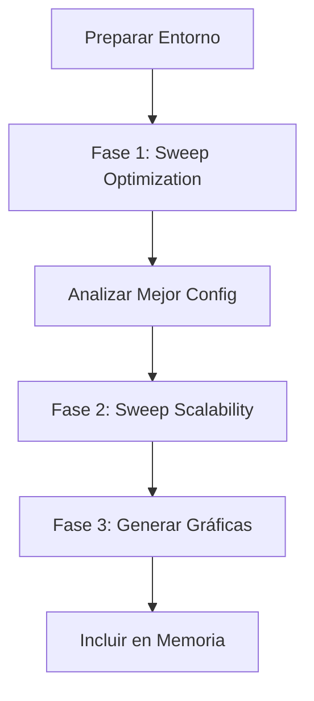

# Guía de Experimentación y Optimización (Proyecto TBB)

Esta guía detalla el flujo de trabajo para obtener los datos experimentales necesarios para la memoria, cubriendo la búsqueda de parámetros óptimos y el estudio de escalabilidad.

---

## 1. Preparación del Entorno

Antes de lanzar nada, asegúrate de:

- ✅ Estar conectado a la **VPN de la UC3M**.
- ✅ Tener el repositorio limpio y actualizado.
- ✅ Subir y compilar la última versión del código:

```bash
make remote-build
```

---

## 2. Fase 1: Búsqueda de Parámetros Óptimos

**Objetivo:** Determinar qué estrategia de particionado (Partitioning) y qué tamaño de grano (Grain Size) ofrecen el mejor rendimiento para la escena 5 en el nodo stan.

**Script:** `scripts/remote/sweep_optimization.sh`

**Qué hace:** Ejecuta el programa fijando los hilos al máximo (112) y probando todas las combinaciones de:
- `--partitioner`: `auto`, `simple`, `static`, `affinity`.
- `--grain`: `0` (auto), `1`, `32`, `64`, `128`, `256`, `512`, `1024`.

### Instrucciones:

1. **Lanza el experimento:**
   ```bash
   make sweep-opt
   ```

2. **Espera a que termine** (monitoriza con `squeue -u <usuario>`).

3. **Descarga los resultados:**
   ```bash
   make fetch-results
   ```

4. **Análisis:** Se generará el archivo `logs/results_optimization.csv`. Ejecuta el script de análisis para encontrar el ganador automáticamente:
   ```bash
   python3 scripts/analysis/analyze_best.py logs/results_optimization.csv
   ```

**Salida esperada (ejemplo):**
```
Mejor Configuración: Partitioner=static, Grain=64
```

---

## 3. Fase 2: Estudio de Escalabilidad (Speedup)

**Objetivo:** Analizar cómo mejora el rendimiento al aumentar el número de hilos, utilizando la configuración óptima encontrada en la Fase 1. Cubre el requisito de probar rangos de hilos (56-112).

**Script:** `scripts/remote/sweep_scalability.sh`

**Qué hace:** Fija el particionador y grano óptimos, y varía `--threads` en la secuencia: `1, 2, 4, 8, 16, 28, 56, 60, 64... 112`.

### Instrucciones:

1. **Lanza el experimento** pasando los parámetros ganadores de la Fase 1:
   ```bash
   # Ejemplo: si ganó static con grano 64
   make sweep-scale PART=static GRAIN=64
   ```

2. **Espera a que termine.**

3. **Descarga los resultados:**
   ```bash
   make fetch-results
   ```
   (Esto actualizará `logs/results_scalability.csv`).

---

## 4. Fase 3: Generación de Gráficas para la Memoria

**Objetivo:** Crear las imágenes visuales del Speedup y la Eficiencia.

**Script:** `scripts/analysis/plot_results.py`

### Instrucciones:

1. **Asegúrate de tener las librerías necesarias:**
   ```bash
   pip install pandas matplotlib
   ```

2. **Ejecuta el generador:**
   ```bash
   python3 scripts/analysis/plot_results.py
   ```

3. **Resultado:** En la carpeta `logs/` tendrás:
   - `grafica_speedup.png`: Curva de aceleración vs ideal.
   - `grafica_tiempo.png`: Tiempo de ejecución vs número de hilos.

---

## Resumen de Archivos Clave

| Archivo                      | Función                                                    |
|------------------------------|------------------------------------------------------------|
| `sweep_optimization.sh`      | Barre todas las combinaciones de Partitioner/Grain.        |
| `sweep_scalability.sh`       | Barre el número de hilos con la config. óptima.            |
| `results_optimization.csv`   | Datos brutos de la Fase 1.                                 |
| `results_scalability.csv`    | Datos brutos de la Fase 2.                                 |
| `analyze_best.py`            | Te dice cuál es la mejor configuración.                    |
| `plot_results.py`            | Crea las imágenes PNG para el PDF.                         |

---

## Flujo de Trabajo Completo



---
