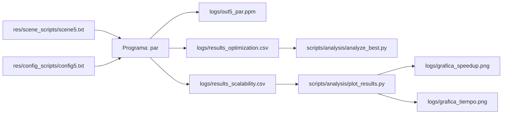
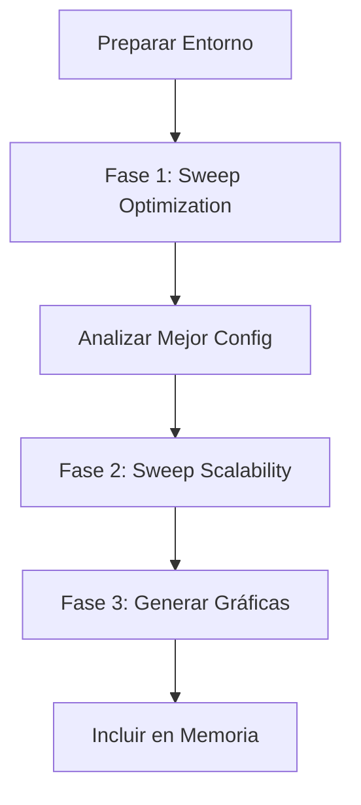

# Manual de Experimentación Avanzada y Optimización (Proyecto TBB)

Este documento detalla la infraestructura de pruebas científicas que hemos implementado para el proyecto. El objetivo es cumplir con los requisitos de "El Jefe" (Profesor): **encontrar los parámetros óptimos justificándolos con datos**, y **analizar la escalabilidad del sistema**.

---

## 1. ¿Qué hemos construido? (La Arquitectura)

Hemos modificado el código C++ (`main.cpp`, `rendering_engine.hpp`, `image_par.cpp`) para que deje de ser estático. Ahora el programa es **totalmente configurable desde la línea de comandos**.

### Nuevos Argumentos del Ejecutable

Ahora podemos lanzar el programa así:

```bash
./render-par scene.txt config.txt out.ppm \
    --render-part static --render-grain 64 \
    --image-part auto --image-grain 0 \
    --threads 56
```

**Argumentos clave:**

- `--render-part`: Define el algoritmo de reparto para el trazado de rayos (la parte pesada).
  - **Opciones:** `auto`, `simple`, `static`, `affinity`.
- `--render-grain`: Define cuántas filas/bloques procesa un hilo antes de soltar el control.
- `--threads`: Limita artificialmente cuántos núcleos usa TBB (Vital para medir escalabilidad).

---

## 2. Los Scripts de Automatización (Los "Robots")

En lugar de lanzar comandos a mano, tenemos **3 scripts** en `scripts/remote/` que automatizan el trabajo sucio en el clúster Avignon.

### A. `sweep_optimization.sh` (El Buscador de la Mejor Configuración)

**Objetivo:** Encontrar qué combinación de **Particionador** y **Grano** hace que el renderizado sea más rápido.

**Qué hace:** Fija los hilos al máximo (112) y prueba todas las combinaciones.

**Variables que podéis tocar (dentro del script):**

- `PARTITIONERS=("auto" "simple" "static" "affinity")`: Si queréis dejar de probar alguno, borradlo de la lista.
- `GRAINS=(0 1 32 64 128 ...)`: Podéis añadir tamaños de grano locos (ej: `5`, `1000`) para ver qué pasa.

**Salida:** `logs/results_optimization.csv`.

---

### B. `sweep_scalability.sh` (La Curva de Speedup)

**Objetivo:** Demostrar cómo mejora el rendimiento al añadir más CPUs. Es fundamental para la **gráfica de Speedup**.

**Qué hace:** Usa la **"Mejor Configuración"** (que hayáis encontrado en el paso A) y varía los hilos desde 1 hasta 112.

**Qué tocar:**

- Las variables `BEST_PART` y `BEST_GRAIN` al principio del script (se pueden pasar por argumento o escribir a fuego).
- El bucle `for`: Podéis cambiar los pasos. Ahora mismo hace `1, 2, 4...` y luego del 56 al 112 de 4 en 4.

**Salida:** `logs/results_scalability.csv`.

---

### C. `sweep_matrix.sh` (La Opción Nuclear ☢️)

**Objetivo:** Probar **TODO contra TODO**. Ideal si sospecháis que la configuración de la Imagen afecta a la del Motor, o queréis una tabla gigante de datos.

**Qué hace:** 5 bucles anidados. Prueba combinaciones de `(Render Part/Grain)` × `(Image Part/Grain)` × `(Hilos)`.

**⚠️ Advertencia:** Este script tarda mucho. Usadlo seleccionando rangos pequeños en las variables `RENDER_PARTS`, `THREAD_LIST`, etc.

---

## 3. Flujo de Trabajo Recomendado

Para rellenar la memoria de forma eficiente, seguid este orden:

### Paso 1: Preparación

```bash
make remote-build  # Sube el código y compila en Avignon
```

### Paso 2: Encontrar el Óptimo (Fase de Optimización)

Lanzamos el barrido de parámetros.

```bash
make sweep-opt
```

- **Esperad a que termine** (mirad con `squeue -u <usuario>`).
- **Bajad los datos:** `make fetch-results`.
- **Ejecutad el analista automático:**

```bash
python3 scripts/analysis/analyze_best.py logs/results_optimization.csv
```

Esto os dirá: **"El ganador es Static con Grano 64"**.

### Paso 3: Medir la Escalabilidad (Fase de Análisis)

Usando los datos del ganador (ej: `static`, `64`), lanzamos la curva de hilos.

```bash
make sweep-scale PART=static GRAIN=64
```

- **Esperad a que termine.**
- **Bajad los datos:** `make fetch-results`.

### Paso 4: Generar Gráficas (Fase de Memoria)

Generamos las imágenes PNG automáticamente.

```bash
python3 scripts/analysis/plot_results.py
```

Tendréis `logs/grafica_speedup.png` lista para pegar en el PDF.

---

## 4. Qué analizar en los datos (Chuleta para la Memoria)

Cuando miréis los CSV o las gráficas, buscad esto para escribir conclusiones brillantes:

### 4.1. La forma de U del Grano

- Con **grano muy pequeño** (1), hay mucho overhead de gestión.
- Con **grano muy grande** (1024), hay desbalanceo de carga (un hilo acaba y espera a los otros).
- El **óptimo suele estar en medio** (32-64). Si os sale óptimo en 1, significa que vuestro renderizado es tan pesado que el overhead de TBB es despreciable.

### 4.2. Saturación de Hilos

Observad la gráfica de tiempo. Bajará rápido hasta llegar a **56 hilos** (núcleos físicos de Stan).

De **56 a 112** (HyperThreading), la mejora será mínima o incluso empeorará.

**Conclusión:** _"El HyperThreading ayuda a ocultar latencias de memoria, pero no duplica la potencia de cálculo en punto flotante"_.

### 4.3. Comparativa de Particionadores

- **Static:** Suele ganar si todos los píxeles cuestan lo mismo de calcular (carga balanceada).
- **Auto:** Es el todoterreno.
- **Dynamic/Simple:** Ganan si la escena es muy irregular (ej: una esquina es cielo vacío y la otra tiene espejos y cristales).
  - En vuestra escena 5, ¿hay mucho vacío? Eso explicaría los resultados.

---

## 5. Comandos Rápidos (Makefile)

| Comando | Acción |
|---------|--------|
| `make remote-build` | Sube código y compila. |
| `make sweep-opt` | Lanza el test de optimización. |
| `make sweep-scale` | Lanza el test de hilos (usa `PART` y `GRAIN`). |
| `make fetch-results` | Descarga todos los CSVs y Logs a tu PC. |
| `python3 scripts/analysis/plot_results.py` | Crea las gráficas. |

---

## 6. Flujo de Archivos en el Proyecto



---

## 7. Flujo de Trabajo Completo



---

## Notas Finales

- **Siempre verificad** que estáis conectados a la VPN de la UC3M antes de lanzar comandos remotos.
- **Documentad todo:** Los datos raw están en `logs/`, guardadlos por si necesitáis regenerar gráficas.
- **Interpretad los resultados:** No basta con pegar gráficas, explicad por qué Static ganó, por qué el grano óptimo es X, etc.

---

_Última actualización: 2025-12-04_
