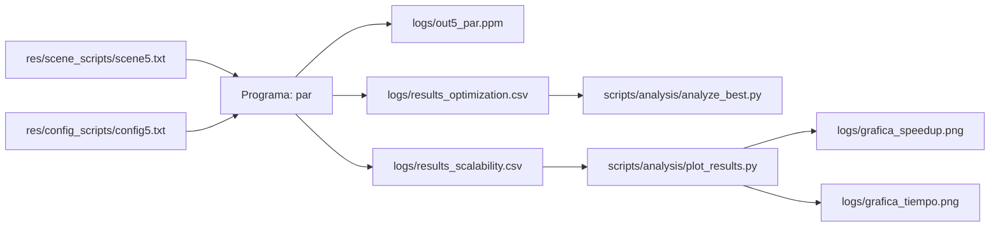
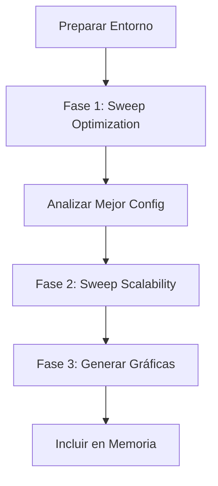

# Manual de Experimentación Avanzada y Optimización (Versión 2.0)

Este documento detalla la infraestructura completa de pruebas científicas para el proyecto. Cubre desde la optimización básica hasta la combinación total de parámetros y la experimentación manual segura en el clúster.

---

## 1. ¿Qué hemos construido? (La Arquitectura)

Hemos modificado el código C++ (`main.cpp`, `rendering_engine.hpp`, `image_par.cpp`) para que deje de ser estático. Ahora el programa es **totalmente configurable desde la línea de comandos**.

### Argumentos del Ejecutable

```bash
./render-par scene.txt config.txt out.ppm \
    --render-part static --render-grain 64 \
    --image-part auto --image-grain 0 \
    --threads 56
```

### Tabla de Argumentos

| Argumento | Descripción |
|-----------|-------------|
| `--render-part <tipo>` | Algoritmo para el trazado de rayos (la parte pesada). Opciones: `auto`, `simple`, `static`, `affinity`. |
| `--render-grain <n>` | Tamaño de grano para el trazado de rayos. |
| `--image-part <tipo>` | Algoritmo para el post-procesado de imagen (ligero). Opciones: `auto`, `simple`, `static`, `affinity`. |
| `--image-grain <n>` | Tamaño de grano para la imagen. |
| `--threads <n>` | Límite global de hilos (TBB). Vital para medir escalabilidad. |

> **Nota:** Los antiguos `--partitioner` y `--grain` siguen funcionando y aplican el valor a ambos sistemas a la vez (backward compatibility).

---

## 2. Los Scripts de Automatización (La Flota)

Tenemos **4 scripts** en `scripts/remote/` para diferentes necesidades:

En lugar de lanzar comandos a mano, tenemos **3 scripts** en `scripts/remote/` que automatizan el trabajo sucio en el clúster Avignon.

### A. `sweep_optimization.sh` (El Buscador de la Mejor Configuración)
**Objetivo:** Encontrar la mejor configuración para el **Motor** (fijando hilos al máximo).

**Qué hace:** Fija los hilos a 112 y prueba todas las combinaciones de particionador y grano.

**Uso:** Ideal para una primera pasada rápida.

**Variables que podéis tocar (dentro del script):**

- `PARTITIONERS=("auto" "simple" "static" "affinity")`: Si queréis dejar de probar alguno, borradlo de la lista.
- `GRAINS=(0 1 32 64 128 ...)`: Podéis añadir tamaños de grano locos (ej: `5`, `1000`) para ver qué pasa.

**Salida:** `logs/results_optimization.csv`.

---

### B. `sweep_scalability.sh` (La Curva de Speedup)

**Objetivo:** Analizar cómo escala el rendimiento al subir hilos (**Speedup**).

**Qué hace:** Usa la **"Mejor Configuración"** (que hayáis encontrado en el paso A) y varía los hilos desde 1 hasta 112.

**Uso:** Una vez sabes que (ej) `static/64` es lo mejor, lanzas este para ver la curva de 1 a 112 hilos.

**Qué tocar:**

- Las variables `BEST_PART` y `BEST_GRAIN` al principio del script (se pueden pasar por argumento o escribir a fuego).
- El bucle `for`: Podéis cambiar los pasos. Ahora mismo hace `1, 2, 4...` y luego del 56 al 112 de 4 en 4.

**Salida:** `logs/results_scalability.csv`.

---

### C. `sweep_matrix.sh` (La Opción Nuclear ☢️)

**Objetivo:** Probar **TODO contra TODO** (Producto Cartesiano).

**Qué hace:** 5 bucles anidados. Prueba combinaciones cruzadas: `Render[static]` × `Image[auto]`, `Render[static]` × `Image[simple]`, etc.

**Por qué usarlo:** Para demostrar exhaustividad en la memoria (_"Hemos verificado que la configuración de imagen no interfiere negativamente con la del motor"_).

**⚠️ Advertencia:** Este script tarda mucho. Configura rangos pequeños dentro del script antes de lanzar.

**Salida:** `logs/results_matrix.csv`.

---

### D. `test_custom.sh` (El Laboratorio Manual)

**Objetivo:** Probar una combinación específica sin líos de librerías ni colas largas.

**Qué hace:** Ejecuta una sola vez la combinación que tú escribas en la variable `ARGS` dentro del script.

**Por qué usarlo:** Para "tocar y ver" si una idea funciona rápido.

**Ejemplo de uso:**
1. Edita `scripts/remote/test_custom.sh`
2. Cambia la línea `ARGS="..."` con tus parámetros personalizados
3. Ejecuta: `make run-custom`
4. Ejecuta: `make tail-custom`
5. Compara para ver si es válido: `make compare-custom`

**Salida:** `logs/custom_*.out`.

---

## 3. Flujo de Trabajo Recomendado

Para rellenar la memoria de forma eficiente, seguid este orden:

### Paso 0: Preparación

```bash
make remote-build  # Sube código y compila (Siempre tras cambiar algo)
```

### Paso 1: Encontrar el Óptimo (Fase de Optimización)

Lanzamos el barrido de parámetros del motor.

```bash
make sweep-opt
make fetch-results
python3 scripts/analysis/analyze_best.py logs/results_optimization.csv
```

**Salida esperada:** _"Ganador: Static, Grano 64"_.

---

### Paso 2: Análisis Profundo (Fase Matriz - Opcional)

Si queréis aseguraros de que la imagen no molesta, lanzad la matriz.

```bash
# Editar scripts/remote/sweep_matrix.sh para poner rangos interesantes
sbatch scripts/remote/sweep_matrix.sh
make fetch-results
```

**Nota:** Este paso es opcional pero demuestra exhaustividad científica en la memoria.

---

### Paso 3: Medir la Escalabilidad (Fase de Análisis)

Usando el ganador del Paso 1, lanzamos la curva.

```bash
make sweep-scale PART=static GRAIN=64
make fetch-results
```

---

### Paso 4: Pruebas Manuales (Debug/Curiosidad)

Si queréis probar algo raro (ej: ¿Qué pasa con 200 hilos?):

1. Editad `scripts/remote/test_custom.sh`.
2. Cambiad la línea `ARGS="..."`.
3. Ejecutad:

```bash
make remote-build
make run-custom
make tail-custom
```

---

### Paso 5: Generar Gráficas (Fase de Memoria)

Una vez tengáis `results_scalability.csv`:

```bash
python3 scripts/analysis/plot_results.py
```

Esto generará en `logs/`:
- `grafica_speedup.png`: Curva de aceleración.
- `grafica_tiempo.png`: Tiempo vs Hilos.

---

## 4. Qué analizar en los datos (Chuleta para la Memoria)

Cuando miréis los CSV o las gráficas, buscad esto para escribir conclusiones brillantes:

### 4.1. La forma de U del Grano

- Con **grano muy pequeño** (1), hay mucho overhead de gestión.
- Con **grano muy grande** (1024), hay desbalanceo de carga (un hilo acaba y espera a los otros).
- El **óptimo suele estar en medio** (32-64). Si os sale óptimo en 1, significa que vuestro renderizado es tan pesado que el overhead de TBB es despreciable.

### 4.2. Saturación de Hilos

Observad la gráfica de tiempo. Bajará rápido hasta llegar a **56 hilos** (núcleos físicos de Stan).

De **56 a 112** (HyperThreading), la mejora será mínima o incluso empeorará.

**Conclusión:** _"El HyperThreading ayuda a ocultar latencias de memoria, pero no duplica la potencia de cálculo en punto flotante"_.

### 4.3. Comparativa de Particionadores

- **Static:** Suele ganar si todos los píxeles cuestan lo mismo de calcular (carga balanceada).
- **Auto:** Es el todoterreno.
- **Dynamic/Simple:** Ganan si la escena es muy irregular (ej: una esquina es cielo vacío y la otra tiene espejos y cristales).
  - En vuestra escena 5, ¿hay mucho vacío? Eso explicaría los resultados.

---

## 5. Resumen de Comandos (Makefile)

| Comando | Acción |
|---------|--------|
| `make remote-build` | Sube y compila todo. |
| `make sweep-opt` | Lanza búsqueda de mejor motor. |
| `make sweep-scale` | Lanza curva de hilos (usa `PART` y `GRAIN`). |
| `make run-custom` | Lanza tu prueba manual (`test_custom.sh`). |
| `make tail-custom` | Ve el resultado de tu prueba manual en vivo. |
| `make fetch-results` | Descarga todos los datos a tu PC. |
| `python3 scripts/analysis/plot_results.py` | Crea las gráficas. |

---

## 6. Flujo de Archivos en el Proyecto



---

## 7. Flujo de Trabajo Completo



---

## Notas Finales

- **Siempre verificad** que estáis conectados a la VPN de la UC3M antes de lanzar comandos remotos.
- **Documentad todo:** Los datos raw están en `logs/`, guardadlos por si necesitáis regenerar gráficas.
- **Interpretad los resultados:** No basta con pegar gráficas, explicad por qué Static ganó, por qué el grano óptimo es X, etc.

---